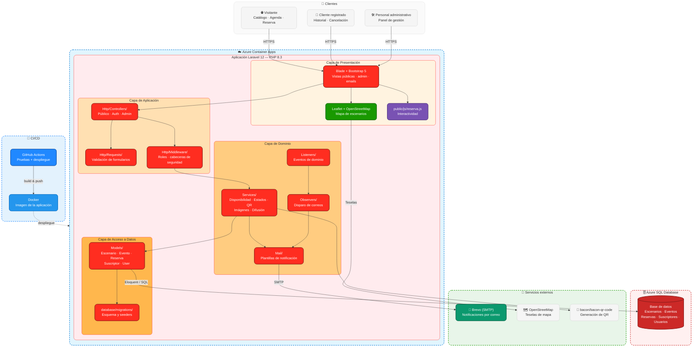

# Reservas Corferias


Aplicación web para reservar escenarios de un centro de convenciones y consultar
la agenda de eventos. Los visitantes revisan disponibilidad y solicitan reservas;
el personal las gestiona desde un panel administrativo.

Reconstrucción sobre Laravel 12 de un proyecto académico originalmente escrito en
Lumen 5.8.

## Demo en vivo

**Aplicación:** [reservas-corferias.blueocean-86680030.eastus.azurecontainerapps.io](https://reservas-corferias.blueocean-86680030.eastus.azurecontainerapps.io/)

## Funcionalidades

**Sitio público**
- Catálogo de escenarios con capacidad, tarifa, galería y fechas ocupadas
- Agenda de eventos
- Solicitud de reserva con validación de disponibilidad
- Comprobante con código único y QR
- Suscripción a la agenda por correo

**Cuenta de cliente**
- Registro con verificación de correo
- Historial de reservas propias
- Cancelación de reservas propias

**Panel de gestión**
- Tablero con métricas
- Reservas: filtros, confirmación y cancelación
- CRUD de escenarios, eventos y usuarios
- Envío de avisos de eventos a la lista de suscriptores

## Stack

| Capa | Tecnología |
|---|---|
| Backend | PHP 8.3, Laravel 12 |
| Base de datos | SQL Server (Azure SQL) |
| Frontend | Blade, Bootstrap 5, CSS propio |
| Mapa | Leaflet + OpenStreetMap |
| Códigos QR | bacon/bacon-qr-code |
| Pruebas | PHPUnit 11 sobre SQLite en memoria |
| CI | GitHub Actions |

## Conexiones externas

| Servicio | Uso | Obligatorio |
|---|---|---|
| SQL Server | Persistencia | Sí |
| Brevo (SMTP) | Notificaciones por correo | No — en desarrollo se escriben en el log; en producción usa el plan gratuito de Brevo (300 correos/día) |
| OpenStreetMap | Teselas del mapa | No (sin registro ni clave) |

## Diagrama de Arquitectura



## Estructura

```
app/
├── Console/Commands/    Comandos de diagnóstico
├── Exceptions/          Excepciones de dominio
├── Http/
│   ├── Controllers/     Público, Auth y Admin
│   ├── Middleware/      Control de roles y cabeceras de seguridad
│   └── Requests/        Validación de formularios
├── Listeners/
├── Mail/                Plantillas de notificación
├── Models/              Escenario, Evento, Reserva, Suscriptor, User
├── Observers/           Disparo de correos por cambio de estado
├── Providers/
└── Services/            Disponibilidad, estados, QR, imágenes, difusión
database/
├── factories/
├── migrations/
└── seeders/
resources/views/
├── layout/              Plantillas base pública y de panel
├── components/          Componentes Blade reutilizables
├── admin/               Vistas del panel
└── emails/              Plantillas de correo
public/
├── css/estilos.css
├── js/reserva.js
└── images/
tests/
├── Unit/                Lógica de disponibilidad
└── Feature/             Flujo HTTP, panel, seguridad y vistas
```

## Requisitos

- PHP 8.3 con las extensiones `sqlsrv`, `pdo_sqlsrv`, `pdo_sqlite`, `sqlite3`,
  `mbstring`, `openssl`, `curl`, `fileinfo`, `zip`, `intl` y `gd`
- Composer 2
- ODBC Driver 17 o 18 para SQL Server
- Una instancia de SQL Server accesible

`pdo_sqlite` y `sqlite3` son necesarias aunque no se use SQLite en producción: la
suite de pruebas corre sobre SQLite en memoria.

## Instalación

```bash
git clone https://github.com/lariasca1994/reservas-corferias.git
cd reservas-corferias
composer install
cp .env.example .env
php artisan key:generate
```

Editar `.env` con los datos de conexión, el servidor de correo y las contraseñas
de las cuentas iniciales. La plantilla indica qué variable corresponde a cada cosa.

Si la base está en un servicio en la nube, hay que habilitar el acceso desde la IP
del equipo en sus reglas de red.

## Puesta en marcha

```bash
php artisan db:ping        # verifica la conexión
php artisan storage:link   # habilita las imágenes subidas
php artisan migrate --seed # crea las tablas y carga datos de ejemplo
php artisan serve
```

La aplicación queda en `http://localhost:8000` y el panel en `/ingresar`.

En Windows, `storage:link` crea un enlace simbólico y puede requerir una consola
con permisos de administrador.

### Diagnóstico

```bash
php artisan proyecto:revisar
```

Comprueba imágenes, enlace de almacenamiento, datos cargados y cuentas del panel,
e indica qué comando ejecutar si algo falta.

## Docker

Alternativa que evita instalar PHP y el driver ODBC:

```bash
docker compose build
docker compose run --rm app composer install
docker compose run --rm app php artisan key:generate
docker compose up -d
docker compose exec app php artisan migrate --seed
```

## Pruebas

No requieren base de datos ni conexión a internet.

```bash
php artisan test
vendor/bin/pint --test
```

## Correos

Con `MAIL_MAILER=log` los mensajes se escriben en `storage/logs/laravel.log` sin
enviarse. Para verlos renderizados en local se puede usar Mailpit apuntando el
mailer a SMTP en `127.0.0.1:1025`.

Con `QUEUE_CONNECTION=database` los correos se encolan y salen al ejecutar
`php artisan queue:work`. Con `sync` salen de inmediato.

Si el proveedor SMTP bloquea IPs no reconocidas (como Brevo), y la app se
despliega en una plataforma cloud con IP de salida variable (como Azure
Container Apps), hay que autorizar esa IP en el proveedor o desactivar el
bloqueo por IP para las claves SMTP — de lo contrario los envíos fallarán
con un error de conexión.

## Despliegue

La aplicación corre en Azure Container Apps (imagen Docker propia), con la base
de datos en Azure SQL Database (plan gratuito) y el envío de correo en producción
a través de Brevo. Las variables de `.env` se definen como secrets de la Container
App.

## Autor

**Luis Felipe Arias Carriazo**
[GitHub](https://github.com/lariasca1994) · [LinkedIn](https://linkedin.com/in/lfac1)

## Licencia

MIT